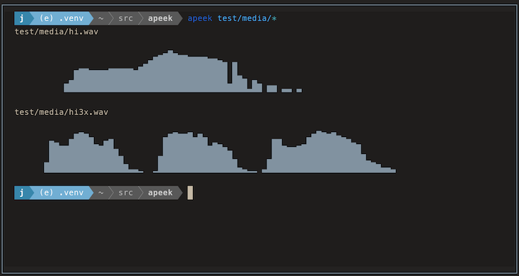

# apeek

  [](https://pypi.org/project/apeek/) 

`apeek` is a package for creating audio waveform previews.

The library installs a command `apeek` for generating waveform overviews with Unicode 
block characters for display in a terminal.

```sh
$ apeek -l12 -i test/media/hi.wav 
                               ▁                                                                     
                              ▃█▅▂▁                                                                  
                            ▅██████▇▇▅▇▃▄▁                                                           
                          ▃▇██████████████▄ ▄                                                        
             ▂      ▁▁▁▂ ▄█████████████████ █                                                        
            ▆██▆▅▇▇█████▇██████████████████ █                                                        
            ███████████████████████████████ █▆                                                       
           ▄███████████████████████████████ ██▆ ▃                                                    
          ▅████████████████████████████████▇███ █▆ ▃▂                                                
          █████████████████████████████████████▄██ ██ ▆▆ ▄                                           
         ▇████████████████████████████████████████ ██ ██ █▄                                          
        ▁█████████████████████████████████████████▇██▅██▅██ ▆▃ ▁                                     
                           max ↑                                                                     
DUR: 0.60 seconds @ 22050Fs // Peak: -2.39 dBFS at 0.31 secs                                         
```

